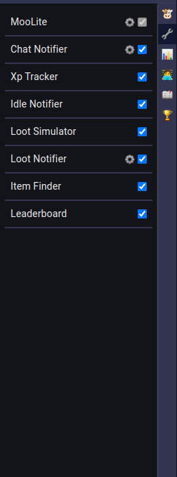

# MooLite

MooLite is a free, open source [Milky Way Idle](https://www.milkywayidle.com/) client.



## Usage

> IMPORTANT: MooLite is implemented as a TamperMonkey user script.
> TamperMonkey is a browser extension that can read and modify webpages you are browsing.
> Make sure you only install MooLite if you trust both TamperMonkey and MooLite not to steal your information.

- Install [TamperMonkey](https://www.tampermonkey.net/) in the browser of your choice.
- Install [MooLite](https://github.com/Ishadijcks/MooLite/raw/release/dist/moolite.user.js) here.

## Development

The following instructions are only relevant if you want to help develop MooLite.
If you're looking to install the browser extension, see [Usage](#usage)

MooLite uses [Vite](https://vitejs.dev/), [Vue 3](https://vuejs.org/), and [TypeScript](https://www.typescriptlang.org/)
to deliver extensions right in thr browser.

### Installation

Install the dependencies to work on this project

```bash
npm install
```

### Running the client locally

Install a local userscript to inject the custom WebSocket.
> This step only needs to be done the first time.

```bash
npm run build-dev
```

Locate the build script in `dist/moolite-dev.user.js`, and drag it into the TamperMonkey Dashboard.


```bash
npm run dev
```

This will run Vite. Once it's booted, click the Vite link in your terminal to open and install the userscript.

> IMPORTANT: Make sure to disable the installed MooLite version while using the dev version.

You can now open the game in your browser, and see the MooLite sidebar.

> If you don't see the sidebar the first time, try refreshing once.
> If you ever don't get the sidebar after that, please open an issue.

### Linting

Enforces the correct styles across all files

```bash
npm run lint
```

## Acknowledgements

This client is heavily inspired by [RuneLite](https://github.com/runelite/runelite/) a great open source OldSchool
RuneScape client.
Most of the design decisions were made to mimic RuneLite, as it has a truly amazing plugin system.

The build process is based on [lisonge/vite-plugin-monkey](https://github.com/lisonge/vite-plugin-monkey), a vite plugin
to create Tampermonkey scripts.

And of course this client would not exist if the very fun game [Milky Way Idle](https://www.milkywayidle.com/) was never
made.
If you enjoy this game, make sure to show the developers some support if you can afford it!

## Privacy

MooLite does not collect user information or analytics of any kind.
The only external request it makes is to load `Vue` from an external CDN.
